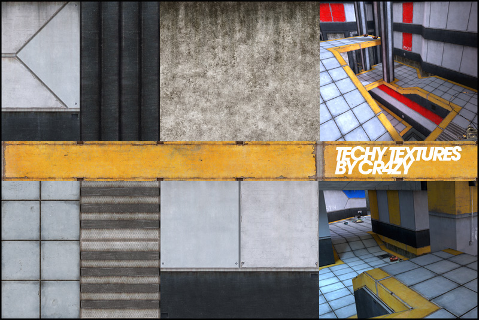

Tech texture set for Unvanquished
=================================

About
-----

Tech is a set of industrial textures initially designed with Unreal Tournament 3 game in mind.

This texture set is a work by Scott “Cr4zy” Coxhead adapted for the [Unvanquished](https://unvanquished.net) game project.

This texture set is meant to be used with a level editor like [NetRadiant](https://netradiant.gitlab.io/).

Visit the [Unvanquished website](https://unvanquished.net/) for more information about the game itself.

Legal
-----

This texture set is available under the terms and conditions of the [Creative Commons Attribution-Share Alike 3.0 license](https://creativecommons.org/licenses/by-sa/3.0).

Consult the [`about/tex-tech.txt`](about/tex-tech.txt) file for a full overview of the contributors of this project.

Credits
-------

- [Scott “Cr4zy” Coxhead](http://www.cr4zyb4st4rd.co.uk/)
- The [Unvanquished team](https://unvanquished.net/about/)
